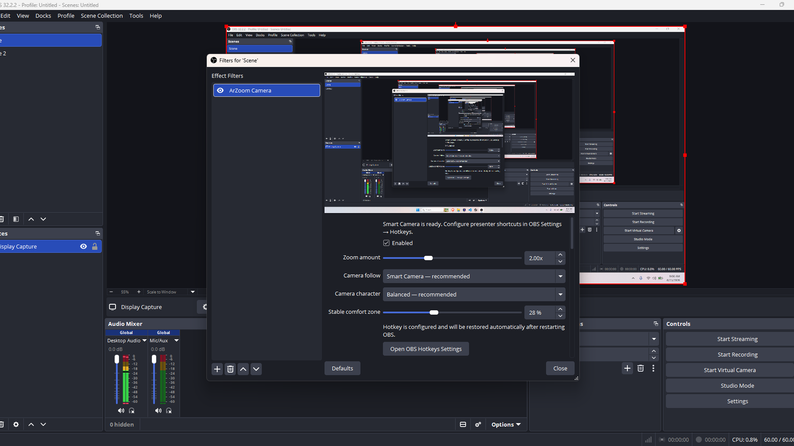

# ArZoom for OBS

<p align="center">
  
</p>

<p align="center">
  <strong>Scene-wide Smart Camera + Presenter Controls + GPU presentation feedback for OBS.</strong><br>
  Zoom where you are explaining, stay steady while you teach, and keep the OBS scene intact.
</p>

<p align="center">
  <a href="https://github.com/masarray/arzoom-follow-obs/releases/latest/download/ArZoom-OBS-Setup-windows-x64.exe"></a>
  <a href="https://masarray.github.io/arzoom-follow-obs/"></a>
</p>

<p align="center">
  
  
  
  <a href="LICENSE"></a>
</p>

ArZoom is a native OBS presentation-camera plugin for tutorials, engineering training, software demonstrations, online classes, product walkthroughs, and live streaming.

**v0.6.0 is the P4.1 stable release:** generalized read-only scale/inset/crop scene mapping plus the accepted **Kinematic Smart Viewport** that keeps pointer context acquired while moving smoothly and settling exactly.

> **Current status:** v0.6.0 public Windows stable. Phase 0 through Phase 4.1 are complete. The Scene Camera architecture, P4.1 mapping scope, and direct-OBS accepted motion behavior are regression-locked in [`docs/P4_1_STABLE_BASELINE.md`](docs/P4_1_STABLE_BASELINE.md).

<p align="center">
  
</p>

## Why Scene Camera

The primary workflow is scene-wide without rewriting the user's composition:

```text
OBS Scene
├─ Display Capture
├─ Webcam
├─ Browser
├─ Logo
└─ Nested Scene
       ↓ OBS native composition
scene obs_source_t
       ↓ normal OBS effect-filter chain
ArZoom Camera
       ↓
SceneViewportPlanner (WHERE)
       ↓
SceneKinematicMotion (HOW)
       ↓
Presenter Controls / click / cursor
       ↓
final scene output
```

ArZoom intentionally does **not** implement scene-wide zoom by calling `obs_sceneitem_set_pos`, `obs_sceneitem_set_scale`, rotation, bounds, or crop setters on the user's composition.

That means:

- no persistent scene-item transform mutation;
- no transform recovery map needed;
- no hidden helper scene item;
- no CPU frame readback;
- no duplicate scene-render graph;
- no second semantic Smart Camera/planner.

## Install

### Recommended: Windows installer

Download:

**[ArZoom-OBS-Setup-windows-x64.exe](https://github.com/masarray/arzoom-follow-obs/releases/latest/download/ArZoom-OBS-Setup-windows-x64.exe)**

Close OBS completely before installation.

The installer supports:

- **Standard OBS Studio** — auto-detected when possible;
- **OBS Portable / custom OBS folder** — browse to the OBS root containing `bin\64bit\obs64.exe`.

### Manual ZIP

A manual ZIP remains available in Releases. Merge its `obs-plugins` and `data` folders into the OBS root folder.

## Recommended v0.6.0 workflow

1. Put one visible top-level **Display Capture** in the scene you want to present.
2. Fullscreen is the simplest setup, but v0.6.0 can also map deterministic positive axis-aligned **scaled/inset** and **cropped** layouts.
3. In OBS choose **Tools → ArZoom — Toggle Scene Camera**.
4. Choose **Tools → ArZoom — Configure Scene Camera** to open the managed scene filter.
5. Disable old per-source ArZoom filters while Scene Camera is active to avoid double zoom.
6. If using an ArZoom Presentation Cursor, disable the native Display Capture cursor to avoid a double cursor.
7. Assign presenter controls in **OBS Settings → Hotkeys**.

The existing per-source **ArZoom Filter** remains available for the lightest Display Capture-only workflow.

## P4.1 scene-wide mapping safety

Pointer-driven Smart Follow, click anchoring, and Presentation Cursor are enabled only when ArZoom can prove a deterministic Display Capture → scene mapping.

v0.6.0 supports:

- exactly one visible top-level Display Capture as the presentation owner;
- deterministically resolved captured monitor;
- positive axis-aligned fullscreen, scaled, or inset placement;
- crop-aware mapping when the transform can be proven;
- one shared mapped coordinate path for Smart Follow, click anchoring, and Presentation Cursor;
- Presentation Cursor size tied to the exact live camera zoom.

ArZoom intentionally fails safe instead of guessing for unsupported or ambiguous cases such as:

- multiple candidate Display Captures without deterministic ownership;
- unproven rotation/skew/flips;
- unsupported bounds modes;
- unresolved nested capture ownership;
- invalid monitor/source geometry.

Presenter zoom/freeze/overview and safe fixed framing remain available when pointer-driven mapping is unavailable.

## Kinematic Smart Viewport

ArZoom follows presentation context rather than chasing every mouse movement.

The accepted v0.6.0 design separates **WHERE** from **HOW**:

- `SceneViewportPlanner` decides the useful contextual framing target;
- `SceneKinematicMotion` moves the camera there using explicit position, velocity, and acceleration state.

Key behavior:

- **Calm local work:** ordinary pointing/explanation movement may produce zero camera movement.
- **Prompt acquisition:** when pointer context leaves the useful viewport area, tracking starts early enough to avoid prolonged loss.
- **Far-distance cruise:** meaningful far travel gets enough bounded authority to keep pace.
- **Jerk-limited motion:** acceleration changes are bounded instead of snapping between speeds/directions.
- **Continuous handoff:** live tracking → final settle preserves motion state; there is no artificial stop/restart.
- **Precision braking:** when the target becomes final, the same motion state transitions into jerk-aware braking to avoid repeated overshoot/searching.
- **Exact HOLD:** completed framing becomes completely still.
- **High-zoom awareness:** smaller high-zoom viewports receive earlier attention without harsh one-frame jumps.

The stable behavioral contract is documented in **[P4.1 Stable Baseline](docs/P4_1_STABLE_BASELINE.md)**.

## Presenter Controls

ArZoom includes profile-persistent OBS hotkeys for:

- Toggle Zoom;
- Hold Zoom;
- Freeze Camera;
- Toggle Smart Follow;
- Zoom In / Zoom Out;
- Reset / Full Frame;
- Overview Peek — hold for a temporary exact 1× overview, release to restore the exact saved shot.

## GPU Click Visualization

Click feedback is composed in the presentation GPU pass and cannot wake, retarget, or accelerate camera motion.

- left: Azure + Aqua dual analytic rings;
- right: Violet + Orchid;
- middle: compact Amber + Gold;
- content-anchored while camera zoom/pan moves;
- fixed four-slot allocation-free event state;
- no PNG generation, particles, CPU rasterization, or frame readback.

## Presentation Cursor

Seven built-in ArZoom-native cursor presets are available:

- Prism;
- Outline;
- Azure;
- Orchid;
- Parakeet;
- Classic Hand;
- Sticker Hand.

Built-ins use short tactile click micro-interactions with exact return to the idle pose. Arrow-tip/fingertip hotspots remain aligned through camera zoom and pan. Advanced users may use custom GIF/WebP/PNG assets.

## Performance principles

ArZoom uses deterministic math and GPU-native presentation effects. It does not require AI, OCR, image recognition, or frame analysis.

The hot path is designed around:

- bounded O(1) camera/control state;
- one cursor sample per active video tick;
- fixed click-event slots;
- no growing history or particle containers;
- no frame readback;
- no per-frame file I/O;
- no per-frame settings writes;
- no scene-item transform mutation;
- OBS pass-through when presentation effects are inactive.

## Compatibility

| Item | v0.6.0 support |
|---|---|
| Operating system | Windows 10/11 x64 |
| Build baseline | OBS Studio 31.1.1 |
| Scene Camera | Supported |
| Per-source Display Capture filter | Supported |
| Scene-wide Smart Follow | One proven top-level Display Capture; fullscreen + deterministic axis-aligned scale/inset/crop mapping |
| Zoom range | 1.10×–4.00× |
| Multi-monitor | Supported, including negative desktop coordinates |
| Mixed DPI | Implemented; broader device validation continues |
| Standard OBS installer | Supported |
| OBS Portable/custom root | Supported |
| Multiple Display Capture ownership | P4.2 future work; never guessed in v0.6.0 |
| macOS / Linux | Not included in current release |

## Deterministic engineering gates

Before Windows packaging, CI runs platform-neutral regression tests covering all prior P0–P4 behavior plus P4.1:

- generalized read-only scene mapping and fail-safe ambiguity cases;
- high-zoom pointer framing and 2×/4× pointer-loss bounds;
- fixed-target convergence;
- bounded jerk;
- no zero-speed stall while meaningful travel remains;
- retarget velocity continuity;
- bounded intentional direction reversal;
- continuous follow pressure;
- tracking chatter / entry bounds;
- no stop-start stalls during real planner sweeps;
- exact final HOLD with zero center/zoom drift and no target regeneration;
- click/cursor/presenter-control and first-click render-safety regression gates.

Run locally on Windows PowerShell:

```powershell
./scripts/run-phase0-validation.ps1
```

## Build from source

Requirements:

- Windows 10/11 x64;
- Git;
- CMake 3.28+;
- Visual Studio 2022 or newer with Desktop development with C++;
- Inno Setup 6 for EXE packaging.

Run:

```text
build-local-windows.bat
```

## Contributor / AI development direction

Before proposing or implementing architectural work, read:

1. **[Current Project Direction](docs/PROJECT_DIRECTION.md)**
2. **[P4.1 Stable Baseline](docs/P4_1_STABLE_BASELINE.md)**

These are the source of truth for accepted v0.6.0 behavior and approaches that are explicitly rejected.

Do not revive the superseded custom scene-camera input-source/off-screen-render experiment or persistent scene-item transform mutation. Do not weaken P4.1 motion-quality gates merely to make a new implementation pass.

## Project documentation

- **[Current Project Direction — start here](docs/PROJECT_DIRECTION.md)**
- **[P4.1 Stable Baseline — regression lock](docs/P4_1_STABLE_BASELINE.md)**
- [Runtime architecture](docs/ARCHITECTURE.md)
- [Phase 4 Zoominator / architecture decision](docs/PHASE4_ZOOMINATOR_AUDIT.md)
- [Smart Camera architecture contract](docs/SMART_CAMERA_ARCHITECTURE.md)
- [Presentation Cursor](docs/PRESENTATION_CURSOR_PRESETS.md)
- [Presenter Controls](docs/PRESENTER_CONTROLS_PHASE3.md)
- [Getting started](https://masarray.github.io/arzoom-follow-obs/guide.html)
- [Troubleshooting](https://masarray.github.io/arzoom-follow-obs/troubleshooting.html)
- [Latest release](https://github.com/masarray/arzoom-follow-obs/releases/latest)

## Privacy

ArZoom does not send analytics, cursor data, captured video, click data, or presentation content anywhere.

## License

ArZoom is open-source software licensed under [GPL-2.0-or-later](LICENSE).

OBS Studio is a trademark of its respective owners. ArZoom is an independent community project and is not affiliated with or endorsed by the OBS Project.
